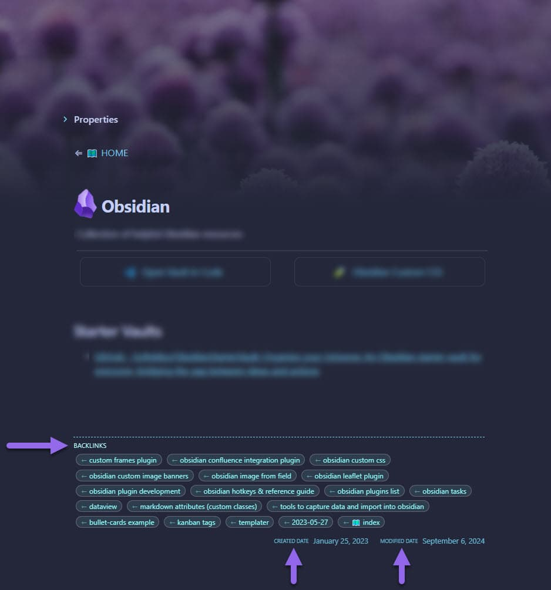

# 🦶 Rich Foot

Rich Foot is an Obsidian plugin that enhances the footer of your notes by adding backlink tags and created/modified dates.



## Features

- Adds backlinks to the footer of your notes
- Displays created and modified dates for each note
- Stylish appearance

## Installation

1. Open Obsidian and go to Settings
2. Navigate to Community Plugins and disable Safe Mode
3. Click on Browse and search for "Rich Foot"
4. Install the plugin and enable it

## Usage

Once installed and enabled, Rich Foot will automatically add the following to the footer of your notes:

- Backlinks: Displayed as tags with links to the referencing notes
- Created Date: Shows when the note was first created
- Modified Date: Shows when the note was last modified

## Customization

## Customization

Rich Foot allows you to customize its behavior by excluding certain folders from generating backlinks. This feature is particularly useful for maintaining a clean and relevant set of backlinks in your notes.

### Excluding Folders

To exclude folders from backlink generation:

1. Go to Obsidian Settings
2. Navigate to the Rich Foot plugin settings
3. In the "Excluded Folders" section, add the paths of the folders you want to exclude
4. Separate multiple folder paths by new lines

For example, if you want to exclude backlinks from your "Archive" and "Templates" folders, you would add:

```
Archive
Templates
```

This will ensure that backlinks are not generated for notes within these folders, keeping your backlink list clean and focused on relevant content.


## License

This project is licensed under the MIT License. See the [LICENSE](LICENSE) file for details.

## Support

If you encounter any issues or have suggestions for improvements, please open an issue on the [GitHub repository](https://github.com/jparkerweb/rich-foot).

## Contributing

Contributions are welcome! Please feel free to submit a Pull Request.

## Author

Created by Justin Parker

---

Enjoy adding rich footers to your Obsidian notes with Rich Foot! 👣
