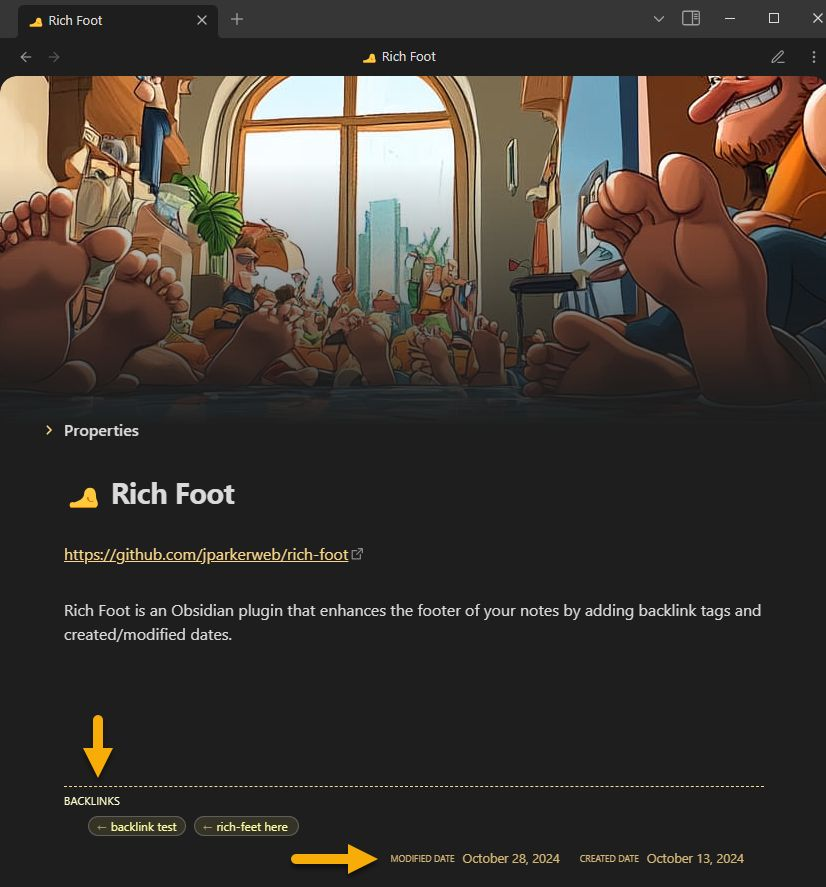

# 🦶 Rich Foot

Rich Foot is an Obsidian plugin that enhances the footer of your notes by adding backlinks, outlinks, and created/modified dates.

## Features

- Adds `backlinks` to the footer of your notes (links FROM other notes TO this note)
- Adds `outlinks` to the footer of your notes (links FROM this note TO other notes)
- Displays `created` and `modified` dates for each note
- Supports links in frontmatter
- Stylish appearance with tag-like links
- Option to exclude folder(s) from displaying 🦶 Rich Foot

## Installation

1. Open Obsidian and go to Settings
2. Navigate to Community Plugins and disable Safe Mode
3. Click on Browse and search for "Rich Foot"
4. Install the plugin and enable it

### Manual Installation
- Unzip the [latest release](https://github.com/jparkerweb/rich-foot/releases/latest) into your `<vault>/.obsidian/plugins/` folder.

## Usage

Once installed and enabled, Rich Foot will automatically add the following to the footer of your notes:

- Backlinks: Displayed as tags showing which notes link TO this note
- Outlinks: Displayed as tags showing which notes this note links TO (disabled by default)
- Created Date: Shows when the note was first created
- Modified Date: Shows when the note was last modified

### Frontmatter Support

Rich Foot also detects links in your note's frontmatter. For example:

```yaml
---
links:
  - "[[Some Note]]"
  - "[[Another Note]]"
---
```

## Customization

Rich Foot provides several customization options through its settings panel:

### Visibility Settings

You can toggle the visibility of each section:
- Show/Hide Backlinks
- Show/Hide Outlinks (disabled by default)
- Show/Hide Dates

### Excluding Folders

You can prevent Rich Foot from appearing in specific folders:

1. Go to Obsidian Settings
2. Navigate to the Rich Foot plugin settings
3. Use the "Add excluded folder" section to:
   - Manually enter a folder path
   - Use the "Browse" button to select a folder
   - Click "Add" to add it to the exclusion list
4. Use the "Delete" button next to any folder to remove it from the exclusion list

Notes:
- Excluding a folder will hide Rich Foot completely from notes in that folder
- Excluded folders also affect all subfolders
- Links from notes in excluded folders will still appear in the backlinks of other notes

## Example Screenshot



## License

This project is licensed under the MIT License. See the [LICENSE](LICENSE) file for details.

## Appreciation
If you enjoy this plugin please consider sending me a tip to support my work 😀
### [🍵 tip me here](https://ko-fi.com/jparkerweb)

## Support

If you encounter any issues or have suggestions for improvements, please open an issue on the [GitHub repository](https://github.com/jparkerweb/rich-foot).

## Contributing

Contributions are welcome! Please feel free to submit a Pull Request.

## Author

Created by Justin Parker

---

Enjoy adding rich footers to your Obsidian notes with Rich Foot! 👣
